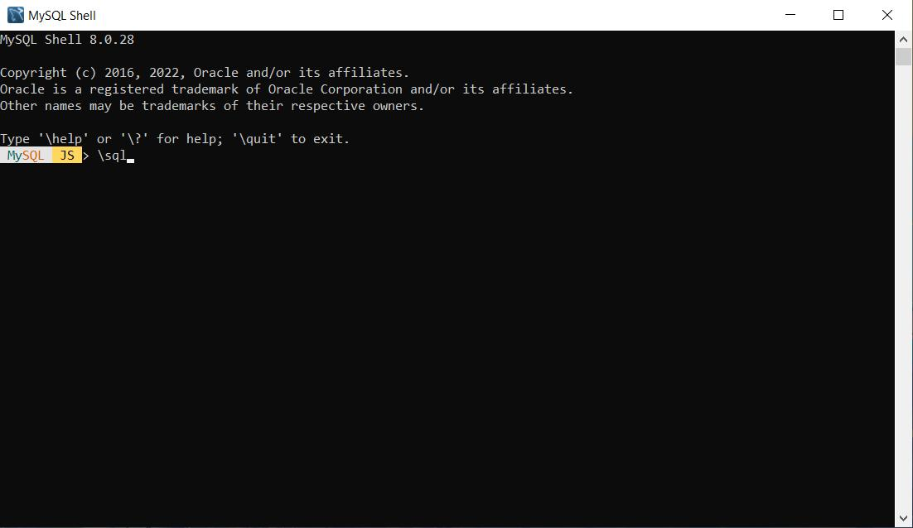

## To build up the project
```
Clone this repository.
```
## First things first
```
First we need to get running our server. 
I used MAMP with Apache. If you dont have MAMP, download it here:
https://www.mamp.info/en/windows/

Once you have MAMP, you just have to set your port of preference, normally is set to 8888 by default, 
click on 'MAMP' -> Preferences -> Ports you should see something like this:
```

```
Now you have to go to 'MAMP' -> Preferences -> Server
Here, you have to choose the parent folder where you cloned the repo,
then press ok.
Something like this:
```

## Database config
```
Now you have your server ready. You can check by starting your server
and going to localhost:8888 (if that's your chosen port)

Next is to configure a database for the project.
You need to have MySql installed.
You can install it from here: https://www.mysql.com/
Once you have it, you can set your data base from PHPMyAdmin page or
directly from the mySql Shell.

If you choose create your database from PhpMyAdmin, enter this url:
http://localhost:8888/phpMyAdmin/?lang=en
you will see something like this:
```

```
You will have to click on 'New' in the left sidebar, this will get you
to the databases menu, then just write your database name (IN THIS CASE challengedb, as this is the name i choose for it and is in the wp-config.php
file) and press 'Create'. That's  it for now

```
## Creating database in MySql Shell
```
If you choose mySql Shell to configure your database you will have to do as
follows:
Open MySql Shell
You will see something like this:
```

```
Enter the command \sql to go sql mode only.
Then you will have to connect to mySql,
write \connect root@localhost and press enter
You will be asked to set a password, if you do, you will have to add it to the
wp-config.php file later, if not, just go on.

Now you can create a database with the command CREATE DATABASE [database name] and
the name of the database (IN THIS CASE challengedb, as this is the name i choose for it and is in the wp-config.php
file)
Once this is done, you're good to go. You can check the database created by
writing the command SHOW DATABASES;

Now you can see the data from the WP database displayed in the front-end SPA.
```
