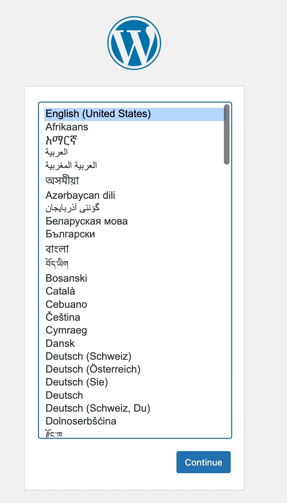

## To build up the project
```
Clone this repository.
```
## First things first
```
First we need to get running our server. 
I used MAMP with Apache. If you dont have MAMP, download it here:
https://www.mamp.info/en/windows/

Once you have MAMP, you just have to set your port of preference, normally is set to 8888 by default, 
click on 'MAMP' -> Preferences -> Ports you should see something like this:
```

```
In the input that says 'MySql Port' in the previous image, should be the port number that phpMyAdmin will assing to it, like this:
```

```
Now you have to go to 'MAMP' -> Preferences -> Server
Here, you have to choose the folder where you cloned the repo,
then press ok.
Something like this:
```

## Database config
```
Now you have your server ready. You can check by starting your server
and going to localhost:8888 (if that's your chosen port)

Next is to configure a database for the project.
You need to have MySql installed.
You can install it from here: https://www.mysql.com/
Once you have it, you can set your data base from PHPMyAdmin page

To go to PhpMyAdmin, enter this url:
http://localhost:8888/phpMyAdmin/?lang=en
you will see something like this:
```

```
You will have to click on 'New' in the left sidebar, this will get you
to the databases menu, then just write your database name (IN THIS CASE challengedb, as this is the name we will use in the next step) and press 'Create'. That's  it for now
```
## Wordpress config
 ```
Go to http://localhost:8888/
you will see this screen: 
```

 ```
Choose English and press continue, now will see this:
```

 ```
Press let's got, next screen should be:
```

 ```
Here you will have to fill up the inputs as follows:

-Database name: challengedb
-Username: root
-Password: root
-Database host: localhost

then press submit

NOTE:
You can always check ths data for mysql in this route:
http://localhost:8888/MAMP/ in the section of mysql
END OF NOTE

Then you will see this screen:
```

 ```
Here, fill up the inputs with the data you want, here i leave some for example
```

 ```
Press Run the installation and then will ask you to log in
```

 ```
Once you are in (localhost:8888) you will see this screen:
```

 ```
Here you will have to go to the left sidebar and click in plugins
```

 ```
Here activate the following plugins:

-Advance custom fields
-Contact Form 7
-Custom post type UI
-Wordpress importer (if this doesn't shows you can activate later)

After this you have to go to CPT UI -> Tools, you will see this screen:
```

 ```
Here in the input under the label 'Import Post Types' you will have to paste
the text that i left in the 'database' folder inside this project, with the name of custom-type-model.json and click import.
This will take a few seconds (maybe a minute)

And final will be going to Tools -> Import in the left sidebar as well, you will see
something like this:
```

 ```
You have to click in 'install now' in the wordpress plugin and then click on
Run importer

You will see this screen:
```

 ```
Here just upload the xml file in the 'database' foler inside this project named
example-database.xml

Then you will see this screen:
```

 ```
Choose your user, click the check box ('Download and import file attachments') and
click Submit

That was the last step

NOW you should be seeing all the data displaying in your front-end in the
localhost:8080
```