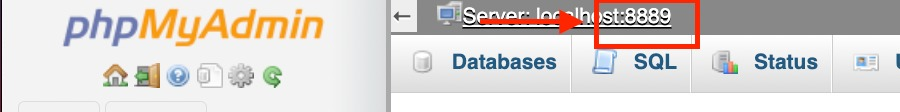
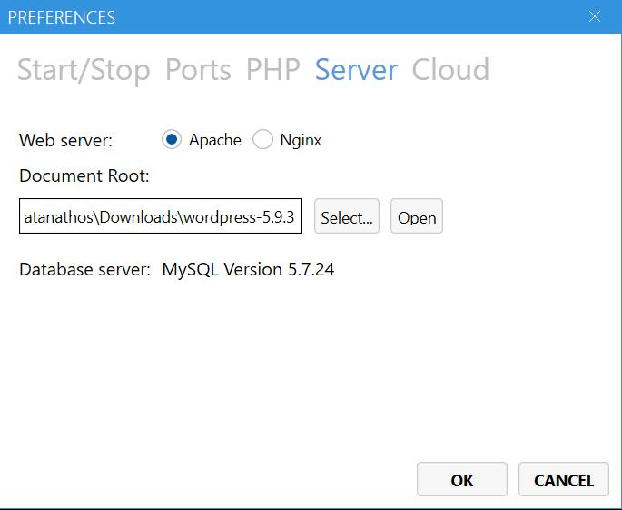

## To build up the project
```
Clone this repository.
```
## First things first
```
First we need to get running our server. 
I used MAMP with Apache. If you dont have MAMP, download it here:
https://www.mamp.info/en/windows/

Once you have MAMP, you just have to set your port of preference, normally is set to 8888 by default, 
click on 'MAMP' -> Preferences -> Ports you should see something like this:
```

```
In the input that says 'MySql Port' in the previous image, should be the port number that phpMyAdmin will assing to it, like this:
```

```
Now you have to go to 'MAMP' -> Preferences -> Server
Here, you have to choose the folder where you cloned the repo,
then press ok.
Something like this:
```

## Database config
```
Now you have your server ready. You can check by starting your server
and going to localhost:8888 (if that's your chosen port)

Next is to configure a database for the project.
You need to have MySql installed.
You can install it from here: https://www.mysql.com/
Once you have it, you can set your data base from PHPMyAdmin page

To go to PhpMyAdmin, enter this url:
http://localhost:8888/phpMyAdmin/?lang=en
you will see something like this:
```

```
You will have to click on 'New' in the left sidebar, this will get you
to the databases menu, then just write your database name (IN THIS CASE challengedb, as this is the name i choose for it and is in the wp-config.php
file) and press 'Create'. That's  it for now

```
